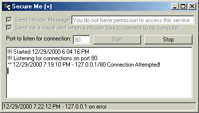



## Secure Me \+

### Description

This code opens up a port on your computer you specifie and listens for a connection.. you have a few options with check boxxes like sending the intruder a message when he connects and displaying a msgbox when someone connects.. its all logged includding date and time.. Great code.. 100% commented on every line.
 
### More Info
 
Winsock control needed

no side effects

             |
---                |---
**Submitted On**   |2000-12-29 18:53:02
**By**             |[meth0s](https://github.com/Planet-Source-Code/PSCIndex/blob/master/ByAuthor/meth0s.md)
**Level**          |Beginner
**User Rating**    |3.8 (23 globes from 6 users)
**Compatibility**  |VB 5\.0, VB 6\.0
**Category**       |[Internet/ HTML](https://github.com/Planet-Source-Code/PSCIndex/blob/master/ByCategory/internet-html__1-34.md)
**World**          |[Visual Basic](https://github.com/Planet-Source-Code/PSCIndex/blob/master/ByWorld/visual-basic.md)
**Archive File**   |[CODE\_UPLOAD1315812292000\.zip](https://github.com/Planet-Source-Code/meth0s-secure-me__1-13941/archive/master.zip)

### API Declarations

None in this project

